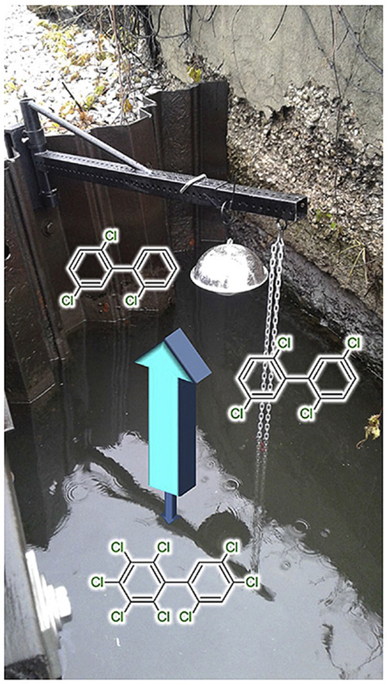
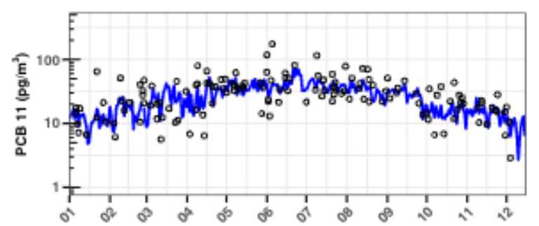

### Hi there 👋
I'm a research engineer at the University of Iowa, and I use R and RStudio to perform statistical analyses and develop mathematical models to try to understand the behavior of polychlorinated biphenyls (PCBs) and other persistent organic pollutants in the environment, as well as in cell experiments. Visit my Google Schoolar to learn more about my research [here](https://scholar.google.com/citations?hl=en&user=b5s4X1cAAAAJ&view_op=list_works&sortby=pubdate).

  
  
  <figcaption>Left photograph shows predicted air/water fluxes of total PCBs from IHSC and left plot shows the temporal distribution of airborne PCB11 in Chicago for 2009 [REFs: Martinez et al., (2002) (https://doi.org/10.1016/j.scitotenv.2021.151505) and Martinez et al., (2019) (https://doi.org/10.1016/j.envpol.2018.10.048)].</figcaption>                                      

<!--
**valdiman/valdiman** is a ✨ _special_ ✨ repository because its `README.md` (this file) appears on your GitHub profile.

Here are some ideas to get you started:

- 🔭 I’m currently working on ...
- 🌱 I’m currently learning ...
- 👯 I’m looking to collaborate on ...
- 🤔 I’m looking for help with ...
- 💬 Ask me about ...
- 📫 How to reach me: ...
- 😄 Pronouns: ...
- ⚡ Fun fact: ...
-->
